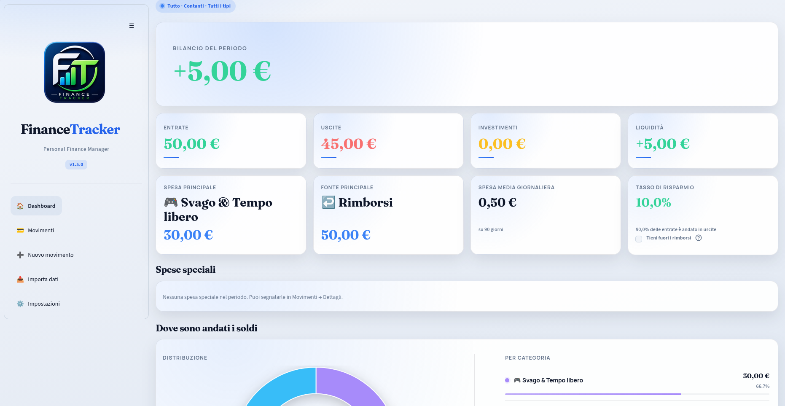
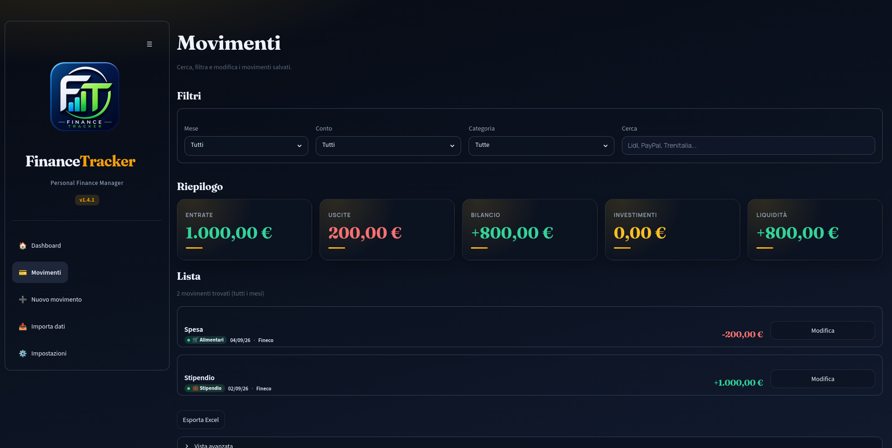
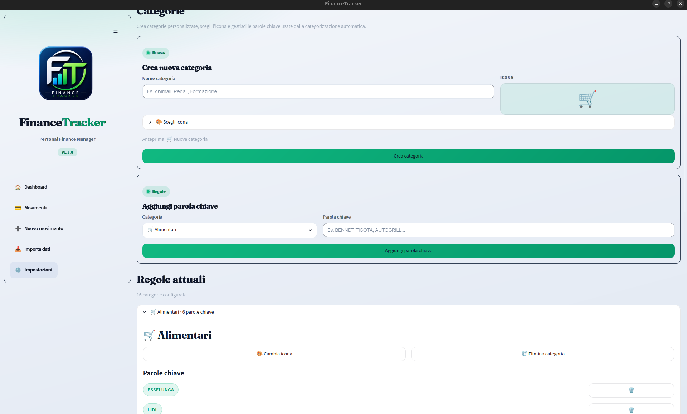
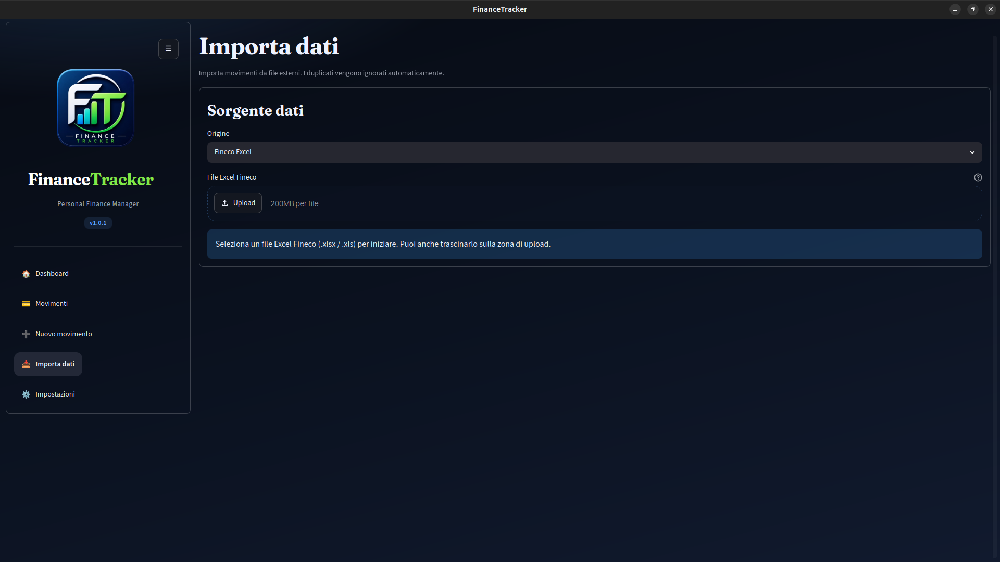

# 💰 FinanceTracker

FinanceTracker è un'app desktop sviluppata in Python per gestire le proprie finanze personali in modo semplice, moderno e completamente offline.

## ✨ Funzionalità

- 📊 Dashboard con KPI
- 🥧 Grafico a torta delle spese
- 💳 Import estratti conto Fineco
- ✍️ Inserimento movimenti manuali
- 🏷️ Gestione categorie e parole chiave
- 💾 Backup del database
- 🔒 Tutti i dati rimangono sul proprio PC

## 🖥️ Tecnologie

- Python
- Streamlit
- SQLite
- Plotly
- PyWebView

## 📷 Screenshot
## 📷 Screenshot

### Dashboard

### Movimenti

### Gestione categorie

### Importa dati

## 🚀 Download

Scarica l'ultima versione dalla sezione **Releases**.

## 📄 Licenza

Questo progetto è distribuito sotto licenza MIT.
